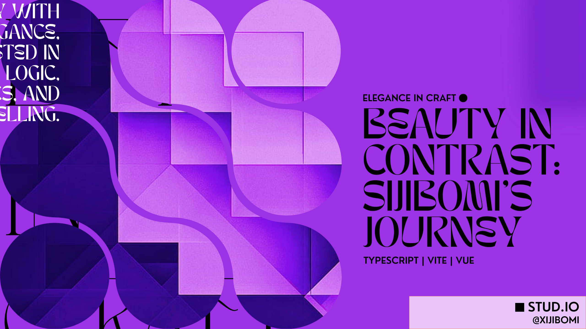

## hi, i’m sijibomi

i build small, opinionated tools with an emphasis on clarity, restraint, and finish.
most of my work sits at the intersection of frontend engineering and interface design.

i care a lot about **usable minimalism**: fewer features, sharper edges, better defaults.
currently focused on javascript/typescript, capacitor-based apps, and performance-conscious ui systems.

---

## selected projects

**supermouse v2**
a refined javascript utility for advanced mouse interactions and ui control.
built with a strong focus on ergonomics, composability, and real-world usage.
→ this is my most complete and representative work.

**prism** (formerly mathlly)
an interactive, visual-first approach to learning math concepts.
focused on making abstractions tangible rather than exhaustive.

**pane**
a mobile utility app combining a flip clock, pomodoro, alarm, and stopwatch.
built with capacitor; designed as a single-purpose, low-distraction time tool.

**everyday**
a minimalist adhd-friendly task tracker.
deliberately avoids gamification and clutter in favor of frictionless capture.

*(older or experimental projects are archived for reference.)*

---

## tools & stack

**languages**
javascript, typescript, html, css

**frontend**
react, vue, tailwindcss, vite

**tooling**
pnpm, git, vercel

**design**
figma (primary), inkscape (occasionally)

---

## interests

* interface minimalism and constraint-driven design
* developer ergonomics and small, sharp abstractions
* speculative fiction (consciousness, memory, simulation)

---

## links

* website: [https://sijibomiio.vercel.app](https://sijibomiio.vercel.app)
* twitter/x: [https://x.com/xijibomi](https://x.com/xijibomi)
* google dev profile: [https://g.dev/whitestar14studios](https://g.dev/whitestar14studios)
