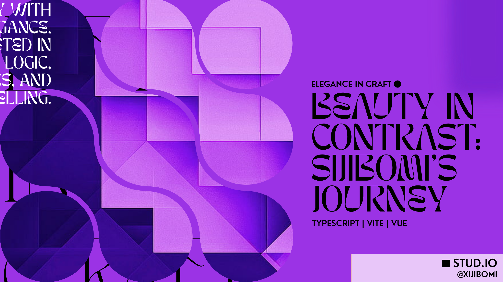

## hi, i'm sijibomi

i build small, opinionated tools — with emphasis on clarity, restraint, and finish.

most of what i make lives at the edge of frontend engineering and interface design. my consistent preoccupation is **usable minimalism**.

i'm trying to build the right thing, correctly.

---

## selected projects

**supermouse v2**  
a typescript cursor engine for advanced mouse interactions and ui control.  
ergonomic, and composable 
→ the most complete picture of how i think about library design.

**prism** *(formerly mathlly)*  
a vue.js math tool with PWA support.
developer-centric, but useful to anyone who thinks in numbers.

**pane**  
a capacitor mobile app with flip clock, pomodoro, alarm, stopwatch all one screen, no noise.  
single-purpose and proud of it.

*(older work is archived.)*

---

## tools & stack

**languages** — javascript, typescript, html, css, rust  
**frontend** — react, vue, tailwindcss, vite  
**tooling** — pnpm, git, vercel  
**design** — figma (primary), inkscape (when necessary)

---

## links

[website](https://sijibomiio.vercel.app) · [twitter](https://x.com/xijibomi) · [google dev](https://g.dev/whitestar14studios)
